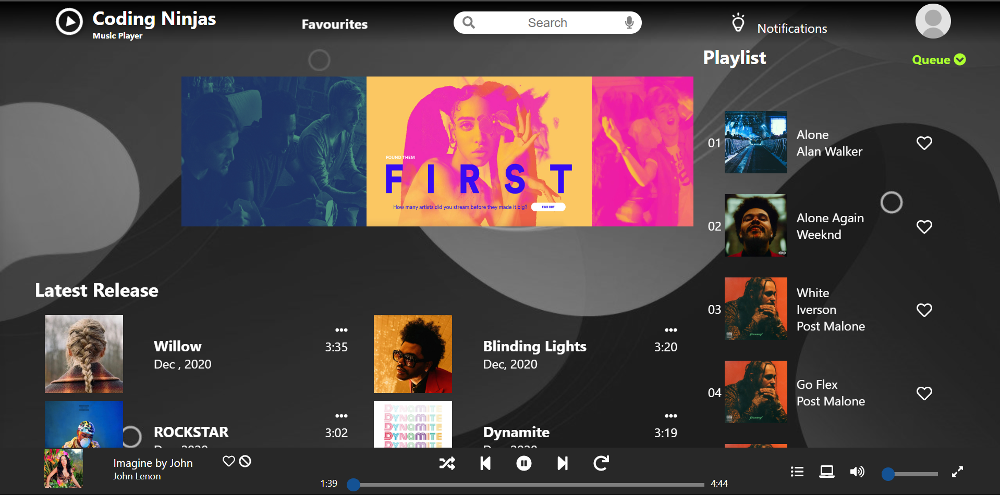

# 🟢 Spotify Clown 🎧



A Spotify-inspired frontend UI built using React.

---

## 📁 Project Overview

**Spotify Clown** is a responsive React-based clone of the Spotify user interface. It mimics the layout, theme, and UX of the official Spotify web player. Built for practice and showcasing frontend skills using React and modern CSS.

---

## 🚀 Features

- 🎵 Clean and responsive Spotify-like UI  
- 🔍 Sidebar with Home, Search, and Library  
- 🎨 Styled components & reusable layout  
- 📱 Mobile-friendly design  
- ⚛️ Built with functional React components  
- 🔧 Easy to extend (e.g., for integrating Spotify APIs later)

---

## 🛠️ Tech Stack

- **React** (CRA)
- **CSS3 / SCSS**
- **JavaScript (ES6+)**
- **React Icons**
- **Responsive design**

---

## 📦 Getting Started

### Prerequisites:
- Node.js installed (v14+ recommended)
- Git installed

### Run locally:
```bash
git clone https://github.com/VIGNESH-BOOPATHI/Spotify-Clown.git
cd Spotify-Clown
npm install
npm start

🙌 Author
Vignesh Boopathi
GitHub Profile
Built as a personal project to improve React skills and UI development.

📄 License
This project is for educational and learning purposes only.
Not affiliated with Spotify.

